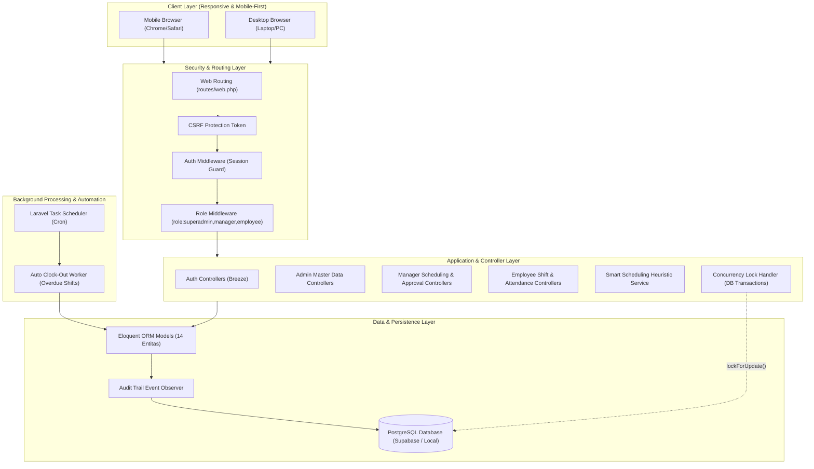
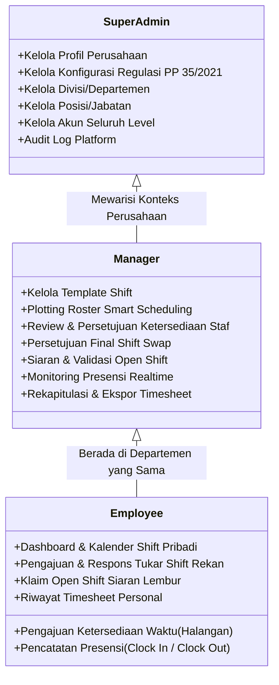
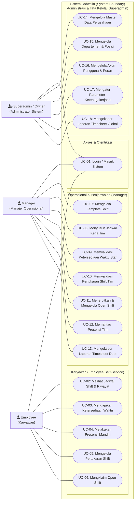
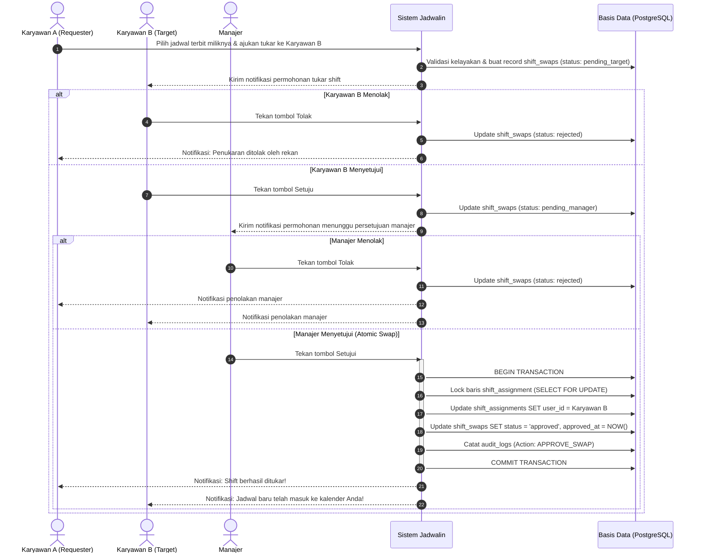
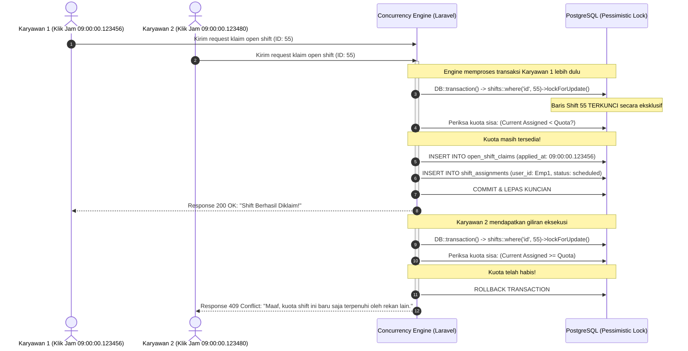
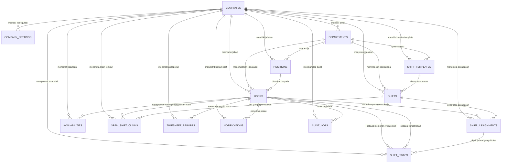
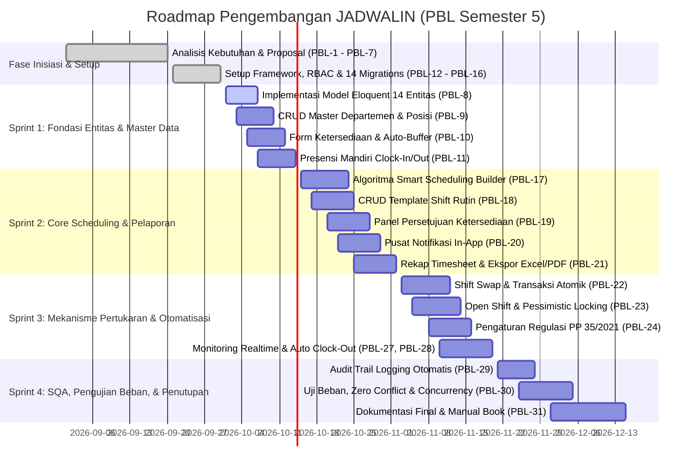

# DOKUMEN PERANCANGAN SISTEM LENGKAP (SYSTEM DESIGN DOCUMENT / SDD)
## JADWALIN — B2B Smart Shift Scheduling Platform
**Platform Berbasis Web untuk Otomatisasi Roster Kerja Karyawan Berbasis Algoritma Cerdas & Kepatuhan Regulasi Ketenagakerjaan**

---

### Informasi Proyek & Identitas Tim
- **Nama Sistem**: JADWALIN (B2B Smart Shift Scheduling Platform)
- **Kategori**: Proyek Pembelajaran Berbasis Proyek (Project-Based Learning / PBL) — Semester 5
- **Institusi**: Jurusan Teknologi Informasi / Rekayasa Perangkat Lunak
- **Repositori & Jira Project**: `PBL` (Key: `PBL-1` s.d. `PBL-31`)
- **Susunan Tim Pengembang & Matriks Peran (RACI)**:
  1. **Muhammad Farras A.A** — *Project Manager & Lead Backend Developer* (Manajemen proyek via Jira, arsitektur backend Laravel, algoritma *Smart Scheduling Builder*, transaksi atomik shift swap & open shift locking).
  2. **Umi Maharani** — *Full-Stack Developer & System Analyst* (Spesifikasi teknis SKPL, Activity Diagram, integrasi front-to-back, modul presensi mandiri, logika persetujuan berjenjang, rekapitulasi timesheet & kalkulasi lembur).
  3. **Neyza Ratu Anastasya** — *UI/UX Designer & Technical Writer* (Perancangan sistem desain Figma, *Mobile-First Design System*, form ketersediaan waktu, komponen layout responsif, dokumentasi user manual book).
  4. **Muhammad Yusuf** — *Database Designer & System Analyst* (Pemodelan skema basis data 14 entitas relasional, integritas referensial ERD, optimasi query, modul CRUD Master Data organisasi).

---

## 1. PENDAHULUAN & GAMBARAN UMUM SISTEM

### 1.1 Latar Belakang & Urgensi Masalah
Pada industri layanan operasional dinamis seperti Food & Beverage (F&B), kafe, ritel modern, perhotelan, dan destinasi pariwisata, penyusunan jadwal kerja shift menghadapi kompleksitas tinggi:
1. **Fluktuasi Ketersediaan Karyawan Fleksibel (Part-Time/Mahasiswa)**: Karyawan paruh waktu memiliki jadwal dinamis (perkuliahan, ujian, kegiatan pribadi) yang sering berubah sewaktu-waktu.
2. **Bentrok Waktu & Kelelahan Akibat Kurangnya Jeda Transisi (*Fatigue/Overlapping*)**: Penjadwalan konvensional melalui spreadsheet sering mengabaikan waktu tempuh perjalanan antar aktivitas dan waktu persiapan kerja.
3. **Kepatuhan Regulasi Ketenagakerjaan (PP No. 35 Tahun 2021)**: Batas maksimal jam kerja reguler (40 jam/minggu) serta batasan lembur (maksimal 4 jam/hari atau 18 jam/minggu) sering dilanggar tanpa disengaja, berpotensi memicu sanksi ketenagakerjaan dan membengkaknya anggaran *overtime*.
4. **Friksi Pertukaran Shift (*Shift Swapping*)**: Proses tukar shift manual via aplikasi perpesanan instan bersifat informal, rawan miskomunikasi, tanpa persetujuan berjenjang yang valid, dan tidak tercatat secara administratif.
5. **Rebutan Jadwal Kosong (*Open Shift Race Condition*)**: Ketika shift kosong ditawarkan, klaim yang tidak diisolasi secara atomik di basis data dapat menimbulkan slot ganda (dua orang hadir untuk satu kuota yang sama).

### 1.2 Tujuan Sistem
1. Membangun platform penjadwalan multi-tenant B2B yang mampu mengotomatisasi penyusunan roster shift kerja mingguan secara cerdas (*Smart Scheduling Builder*) dengan mempertimbangkan batas jam kerja, kuota operasional, dan ketersediaan staf tanpa konflik.
2. Mengintegrasikan mekanisme perlindungan hukum ketenagakerjaan otomatis yang memisahkan dan membatasi jam kerja reguler serta lembur sesuai **PP No. 35 Tahun 2021**.
3. Menyediakan alur pertukaran jadwal mandiri (*Peer-to-Peer Shift Swap*) dengan verifikasi dua-tahap (*Two-Phase Approval*) yang transparan dan aman secara transaksional.
4. Menerapkan kontrol konkurensi data yang ketat (*Pessimistic Locking & Microsecond Timestamping*) pada klaim shift kosong untuk mengeliminasi anomali *race condition*.
5. Menyajikan antarmuka modern, interaktif, responsif, dan *mobile-friendly* yang memfasilitasi pencatatan kehadiran mandiri (*clock-in/clock-out* dengan *grace period* dan *auto clock-out*) serta pelaporan *timesheet* siap ekspor.

### 1.3 Ruang Lingkup Sistem

#### Ruang Lingkup yang Dikerjakan (In-Scope):
- Arsitektur *Multi-Tenant B2B* (isolasi data antar perusahaan/cabang melalui `company_id`).
- Autentikasi dan *Role-Based Access Control* (RBAC) 3 tingkat: Super Admin, Manajer Operasional, dan Karyawan.
- Manajemen Master Data Perusahaan, Departemen, Posisi Jabatan, dan Konfigurasi Regulasi Ketenagakerjaan.
- Manajemen Pengajuan Ketersediaan Waktu (Halangan Kerja) dengan algoritma *Auto-Buffer* 30 menit.
- Mesin Pembuat Roster Pintar (*Smart Scheduling Builder*) berbasis deteksi konflik dan batas kuota jam.
- Modul *Peer-to-Peer Shift Swap* dengan alur persetujuan dua arah (Rekan -> Manajer) yang atomik.
- Modul *Open Shift Broadcast* & Sistem Klaim dengan penanganan *Race Condition* (*Pessimistic Row-Level Lock*).
- Modul Presensi Mandiri (*Clock-In/Clock-Out*), toleransi keterlambatan (*grace period* 15 menit), serta otomatisasi *Auto Clock-Out*.
- Rekapitulasi *Timesheet* terpadu (kalkulasi pemisahan jam reguler vs lembur) dan ekspor data (Excel & PDF).
- Notifikasi terpusat (*In-App Notifications*) dan Jejak Audit (*Audit Trail Logging*) untuk kepatuhan SQA.

#### Ruang Lingkup yang Tidak Dikerjakan (Out-of-Scope):
- Modul integrasi *Payment Gateway* untuk penggajian transfer otomatis antar bank (diserahkan via ekspor laporan spreadsheet ke departemen keuangan).
- Otentikasi biometrik pemindai sidik jari perangkat keras eksternal (menggunakan pencatatan berbasis web terotentikasi).
- Pelacakan pergerakan GPS secara *realtime live tracking* di luar momen pencatatan presensi.

---

## 2. ARSITEKTUR SISTEM & LANDASAN TEKNOLOGI

### 2.1 Arsitektur Tingkat Tinggi (High-Level Architecture)
Jadwalin dibangun mengikuti arsitektur **Model-View-Controller (MVC)** modern berbasis **Laravel 11.x**, yang mengintegrasikan pemrosesan antarmuka sisi server (*Server-Driven Rendering*) yang cepat dan aman dengan reaktivitas sisi klien (*Client-Side Reactivity*) yang ringan.



### 2.2 Komponen Teknologi (Technology Stack)
| Layer | Teknologi | Versi | Peran & Alasan Pemilihan |
| :--- | :--- | :--- | :--- |
| **Backend Framework** | Laravel | 11.x (PHP 8.2+) | Standar industri enterprise, aman (proteksi injeksi SQL & CSRF bawaan), arsitektur service layer rapi, performa tinggi. |
| **Database Engine** | PostgreSQL (Supabase) / SQLite / MySQL | PostgreSQL 15+ / SQLite 3 | Dukungan tipe data presisi mikrodetik (`timestamp(6)`), integritas *Foreign Key*, performansi *row locking* tinggi, dan skalabilitas *cloud multi-tenant*. |
| **Frontend Styling** | Tailwind CSS | 3.4+ | *Utility-First CSS*, ukuran bundel sangat kecil, konsistensi tema warna ungu/indigo Jadwalin (`#6C5CE7`), implementasi *Mobile-First Design*. |
| **Frontend Interactivity**| Alpine.js | 3.x | Reaktivitas deklaratif ringan tanpa *overhead* berat framework SPA (React/Vue), ideal untuk modal, dropdown, dan validasi form dinamis. |
| **Ikonografi & Aset** | Lucide Icons | Latest | Ikon vektor berbasis SVG yang modern, tajam, dan seragam untuk visualisasi peran, jadwal, dan status. |
| **Build Tooling** | Vite | 5.x | *Hot Module Replacement* (HMR) berkecepatan tinggi, *bundling* aset JavaScript dan CSS secara efisien. |
| **Automated Testing** | PHPUnit & Pest PHP | 10.x / 11.x | Pengujian regresi otomatis (*Unit Testing* & *Feature Testing*), validasi alur RBAC, serta simulasi logika jadwal. |

### 2.3 Strategi Isolasi Multi-Tenant (*Company-Scoped Isolation*)
Sistem mengadopsi model *Shared Database, Shared Schema* dengan partisi logis berbasis `company_id`:
- Setiap entitas operasional (`users`, `departments`, `positions`, `shifts`, `shift_assignments`, `availabilities`, `shift_swaps`, `open_shift_claims`, `timesheet_reports`, `notifications`, `audit_logs`) memiliki kolom `company_id` bertipe Foreign Key ke tabel `companies`.
- Logika query Controller dan Eloquent ORM diwajibkan menerapkan *global/local scope* berbasis perusahaan (`where('company_id', auth()->user()->company_id)`), menjamin data antar entitas bisnis tidak bocor satu sama lain.

---

## 3. ANALISIS KEBUTUHAN SISTEM (SRS / SKPL)

### 3.1 Identifikasi Aktor & Hak Akses (Role-Based Access Control)
Sistem membagi pengguna ke dalam 3 hierarki otorisasi:



### 3.2 Diagram Use Case Sistem (Use Case Diagram)
Diagram Use Case memodelkan interaksi antara pengguna (*actors*) dengan kapabilitas fungsional platform *Jadwalin* dalam batasan sistem (*system boundary*). Model ini merefleksikan 18 fungsionalitas utama yang terbebas dari anti-pattern *functional decomposition*, di mana logika komputasi internal (filter ketersediaan, pengecekan kuota, dan peringatan anti-bentrok) telah diintegrasikan sebagai bagian dari skenario alur kerja penyusunan jadwal (*Smart Scheduling Builder*).



#### Tabel Spesifikasi & Definisi 18 Use Case:
| Kode UC | Nama Use Case | Aktor Primer | Deskripsi Fungsional | Hasil Akhir / Post-condition |
| :--- | :--- | :--- | :--- | :--- |
| **UC-01** | Login / Masuk Sistem | Semua Aktor | Memverifikasi kredensial pengguna dan mengarahkan ke dashboard yang sesuai peran (RBAC). | Pengguna terotentikasi dan sesi aktif tersimpan. |
| **UC-02** | Melihat Jadwal Shift & Riwayat | Employee | Menampilkan kalender kerja mingguan serta rekap riwayat jam kerja presensi personal. | Informasi jadwal personal ditampilkan secara interaktif. |
| **UC-03** | Mengajukan Ketersediaan Waktu | Employee | Mendaftarkan waktu halangan kerja (spesifik/rutin) yang otomatis diproteksi *buffer* 30 menit. | Data pengajuan tersimpan dengan status `pending`. |
| **UC-04** | Melakukan Presensi Mandiri | Employee | Mencatat kehadiran *Clock-In* dan *Clock-Out* secara mandiri berbasis toleransi *grace period*. | Waktu aktual dan durasi kerja tercatat ke tabel `shift_assignments`. |
| **UC-05** | Mengelola Pertukaran Shift | Employee | Mengajukan pertukaran jadwal ke rekan tertentu dan mengonfirmasi persetujuan dari rekan target. | Record `shift_swaps` tercipta dan diteruskan ke tahap persetujuan manajer. |
| **UC-06** | Mengklaim Open Shift | Employee | Mengambil slot shift kosong/lembur dengan jaminan pencegahan *race condition* (*row lock*). | Penugasan shift berhasil dialokasikan kepada karyawan pengklaim tercepat. |
| **UC-07** | Mengelola Template Shift | Manager | Menentukan master jam kerja rutin, kode warna visual, durasi, dan default kuota departemen. | Template tersimpan pada tabel `shift_templates`. |
| **UC-08** | Menyusun Jadwal Kerja Tim | Manager | Menginput kebutuhan kuota harian & staf per divisi, lalu mengeksekusi *Smart Scheduling Builder*. | Draf penugasan shift mingguan terbentuk tanpa konflik waktu. |
| **UC-09** | Memvalidasi Ketersediaan Waktu Staf | Manager | Menyetujui atau menolak permohonan halangan kerja yang diajukan oleh staf divisi. | Status ketersediaan diperbarui (`approved`/`rejected`). |
| **UC-10** | Memvalidasi Pertukaran Shift Tim | Manager | Meninjau kesepakatan tukar shift antar staf dan memberikan persetujuan final secara atomik. | Penugasan jadwal bertukar pemilik secara transaksional di basis data. |
| **UC-11** | Menerbitkan & Mengelola Open Shift | Manager | Menyiarkan slot shift kosong yang belum terpenuhi kepada staf divisi yang memenuhi kualifikasi. | Shift berstatus `open_shift = true` dan terlihat di dashboard staf. |
| **UC-12** | Memantau Presensi Tim | Manager | Memantau kehadiran langsung seluruh anggota tim kerja (*Present*, *Late*, *Absent*). | Dasbor monitoring presensi realtime terbarui. |
| **UC-13** | Mengekspor Laporan Timesheet Dept | Manager | Menyaring dan mengunduh rekapitulasi jam kerja reguler dan lembur staf departemen. | Berkas spreadsheet (Excel) atau PDF terunduh. |
| **UC-14** | Mengelola Master Data Perusahaan | Superadmin | Mengelola identitas organisasi, profil tenant, outlet cabang, dan zona waktu operasional. | Master data perusahaan tersimpan di tabel `companies`. |
| **UC-15** | Mengelola Departemen & Posisi | Superadmin | Melakukan CRUD struktur divisi organisasi dan jabatan kerja operasional. | Entitas `departments` dan `positions` terbarui. |
| **UC-16** | Mengelola Akun Pengguna & Peran | Superadmin | Menambah pengguna baru, mengatur peranan RBAC, menugaskan departemen/posisi, dan reset sandi. | Entitas `users` aktif dengan hak akses yang terisolasi. |
| **UC-17** | Mengatur Parameter Ketenagakerjaan | Superadmin | Mengonfigurasi batas reguler 40 jam, batas lembur 18 jam, *auto-buffer*, dan *grace period*. | Konfigurasi tersimpan pada tabel `company_settings`. |
| **UC-18** | Mengekspor Laporan Timesheet Global | Superadmin | Menghasilkan dan mengunduh laporan rekapitulasi kerja komprehensif seluruh departemen/cabang. | Berkas laporan konsolidasian global diterbitkan. |

### 3.3 Matriks Kebutuhan Fungsional (Functional Requirements)
| Kode FR | Modul | Deskripsi Kebutuhan | Aktor Terkait |
| :--- | :--- | :--- | :--- |
| **FR-01** | Autentikasi | Sistem menyediakan fitur masuk (*Login*) dan keluar (*Logout*) dengan proteksi sesi dan hashing kata sandi aman. | Semua Aktor |
| **FR-02** | Pengalihan Peran | Sistem mengarahkan pengguna secara otomatis ke dashboard spesifik perannya pasca login (`/dashboard` &rarr; `/admin`, `/manager`, `/employee`). | Semua Aktor |
| **FR-03** | Master Perusahaan | Super Admin dapat mengelola nama, alamat, surel, kontak, zona waktu (*timezone*), dan status operasional perusahaan. | Super Admin |
| **FR-04** | Pengaturan Regulasi| Super Admin dapat mengonfigurasi batas reguler (40 jam/minggu), batas lembur (18 jam/minggu), *buffer* (30 mnt), dan *grace period* (15 mnt) tingkat perusahaan. | Super Admin |
| **FR-05** | Master Organisasi | Super Admin dapat melakukan CRUD Departemen dan Posisi/Jabatan kerja operasional. | Super Admin |
| **FR-06** | Manajemen Pengguna | Super Admin dapat menambah akun, menentukan peran (*role*), menugaskan departemen/jabatan, dan mengatur status keaktifan staf. | Super Admin |
| **FR-07** | Input Ketersediaan | Karyawan dapat mendaftarkan jadwal halangan kerja (spesifik tanggal atau berulang mingguan) beserta alasan. | Karyawan |
| **FR-08** | Auto-Buffer | Sistem otomatis menambahkan *buffer time* 30 menit sebelum dan sesudah jadwal halangan untuk mencegah penugasan mepet. | Sistem (Otomatis) |
| **FR-09** | Validasi Halangan | Manajer dapat menyetujui (*Approve*) atau menolak (*Reject*) jadwal ketersediaan yang diajukan stafnya. | Manager |
| **FR-10** | Template Shift | Manajer dapat mendefinisikan template master shift (judul, jam mulai, jam selesai, kuota default, kode warna visual). | Manager |
| **FR-11** | Smart Scheduling | Manajer mengonfigurasi kebutuhan kuota shift harian dan jumlah staf per divisi/shift, lalu mengeksekusi *Smart Scheduling Builder* yang menyaring bentrok ketersediaan dan mengecualikan staf *overlimit*. | Manager |
| **FR-12** | Penerbitan Roster | Manajer dapat meninjau draf hasil *generate* dan mengubah status jadwal dari *draft* menjadi *published*. | Manager |
| **FR-13** | Kalender Shift Staf| Karyawan dapat melihat seluruh jadwal shift miliknya yang sudah berstatus *published* dalam tampilan kalender mingguan. | Karyawan |
| **FR-14** | Permintaan Swap | Karyawan dapat memilih shift kerjanya dan mengajukan pertukaran kepada rekan kerja tertentu (*Requester* &rarr; *Target*). | Karyawan |
| **FR-15** | Respons Rekan Swap | Karyawan target dapat menyetujui (*Approve*) atau menolak (*Reject*) permohonan pertukaran shift dari rekannya. | Karyawan |
| **FR-16** | Persetujuan Swap Manajer | Manajer meninjau pertukaran yang telah disepakati kedua karyawan dan memberikan persetujuan final secara atomik. | Manager |
| **FR-17** | Siaran Open Shift | Manajer dapat menerbitkan shift kosong tak bertuan (*Open Shift*) untuk diperebutkan oleh karyawan yang memenuhi syarat. | Manager |
| **FR-18** | Klaim Open Shift | Karyawan dapat menekan tombol klaim pada siaran open shift dengan jaminan pencegahan *race condition* (*lockForUpdate*). | Karyawan |
| **FR-19** | Presensi Mandiri | Karyawan dapat mencatat *Clock-In* saat mulai bekerja dan *Clock-Out* saat mengakhiri tugas secara mandiri dari perangkat mobile. | Karyawan |
| **FR-20** | Grace Period & Keterlambatan | Sistem menghitung selisih menit keterlambatan jika karyawan *Clock-In* melebihi *grace period* (15 menit) dan mencatat status *Late*. | Sistem (Otomatis) |
| **FR-21** | Auto Clock-Out | Sistem secara terjadwal otomatis menutup penugasan shift yang melewati batas akhir operasional jika staf lupa *Clock-Out*. | Sistem (Scheduler) |
| **FR-22** | Monitoring Absensi | Manajer dapat memantau status kehadiran seluruh anggota tim secara langsung (*realtime*), termasuk status keterlambatan (*Late*) dan ketidakhadiran (*Absent*). | Manager |
| **FR-23** | Kalkulasi Jam Kerja | Sistem otomatis memisahkan jam reguler dan jam lembur sesuai durasi kerja aktual dan regulasi PP No. 35/2021. | Sistem (Otomatis) |
| **FR-24** | Ekspor Laporan | Manajer dan Super Admin dapat memfilter periode bulan/tahun dan mengunduh laporan rekapitulasi *timesheet* (Departemen / Global) dalam format Excel (*Spreadsheet*) atau PDF. | Manager, Super Admin |
| **FR-25** | Audit Trail Log | Sistem merekam setiap manipulasi data kritis (tukar shift, publikasi jadwal, hapus shift) lengkap dengan *old* & *new values*, IP, dan aktor. | Sistem (Otomatis) |

### 3.4 Kebutuhan Non-Fungsional (Non-Functional Requirements)
1. **Performa & Waktu Tanggap (Performance)**:
   - Waktu respons pemrosesan HTTP untuk operasi CRUD rata-rata di bawah 300 milidetik.
   - Waktu komputasi algoritma *Smart Scheduling Builder* untuk menghasilkan draf roster 50 karyawan selama 1 pekan maksimal 3 detik.
2. **Keamanan & Integritas Data (Security & Data Integrity)**:
   - Enkripsi kata sandi menggunakan hashing Bcrypt dengan *cost factor* 12.
   - Semua formulir dan panggilan AJAX dilindungi oleh token CSRF (*Cross-Site Request Forgery*).
   - Sanitasi input data dan penggunaan *Prepared Statements* via Eloquent ORM untuk pencegahan *SQL Injection* dan *XSS*.
   - Integritas data transaksional dijamin menggunakan *Database Transactions* (`DB::transaction`) dengan isolasi *Pessimistic Locking*.
3. **Ketersediaan & Keandalan (Availability & Reliability)**:
   - Ketersediaan sistem ditargetkan 99.5% *uptime*.
   - Seluruh kegagalan atau eksepsi tak terduga dicatat pada berkas `storage/logs/laravel.log`.
4. **Skalabilitas & Multi-Tenancy (Scalability)**:
   - Skema basis data terstruktur mendukung multi-perusahaan secara simultan tanpa tercampurnya data antar entitas bisnis (*data leak prevention*).
5. **Kemudahan Penggunaan & Kompatibilitas (Usability & Responsiveness)**:
   - Antarmuka mengadopsi standar *Mobile-First*, mendukung navigasi sentuh yang nyaman pada layar ponsel (*touch-target minimal 44x44 pixel*), tablet, hingga monitor desktop beresolusi tinggi.

---

## 4. PERANCANGAN PROSES BISNIS & LOGIKA ALGORITMA

### 4.1 Algoritma Mesin Penjadwalan Cerdas (*Smart Scheduling Builder*)
Tantangan utama penjadwalan adalah memetakan staf yang tepat pada slot shift tanpa menimbulkan bentrok ketersediaan dan tanpa melanggar kuota jam kerja reguler/lembur.

#### Pseudokode Algoritma Smart Scheduling:
```text
INPUT: company_id, department_id, start_date, end_date, shift_requirements[]
OUTPUT: draft_shift_assignments[], unfilled_slots[]

1. Inisialisasi:
   - Ambil aturan dari 'company_settings' (Max Reguler, Max Lembur, work_hour_limit_type, min_rest_hours, max_working_days_per_week).
   - Ambil daftar seluruh staf aktif pada department_id yang bersangkutan.
   - Hitung jam kerja terakumulasi dan hari kerja aktif (days_worked_count) minggu berjalan per staf.

2. Loop setiap hari dalam rentang [start_date s.d. end_date]:
   3. Loop setiap kebutuhan shift harian [shift_slot]:
      a. Identifikasi kuota yang dibutuhkan (quota_needed).
      b. Filter kandidat karyawan yang memenuhi Kriteria Pembatas Mutlak (Hard Constraints):
         - Status karyawan == 'active'.
         - Kesesuaian posisi/jabatan (users.position_id cocok dengan kualifikasi shift).
         - Evaluasi Hari Libur Mingguan (RDO): days_worked_in_week < max_working_days_per_week (default 6 hari).
           (Jika sudah 6 hari kerja, staf WAJIB libur pada hari berikutnya).
         - Tidak memiliki jadwal halangan terverifikasi (availabilities status == 'approved' / Preferred Day-Off)
           yang beririsan dengan waktu shift (Waktu Shift + Buffer 30 Menit).
         - Tidak memiliki penugasan shift lain di rentang waktu yang sama (Anti-Double Booking).
         - Plafon jam kerja: 
           * Jika Full-Time: total jam + durasi shift <= Max Reguler (40) + Max Lembur (18).
           * Jika Part-Time: total jam + durasi shift <= users.max_weekly_hours (misal 20-24 jam).
           * Jika Freelance: tidak dibebani target rutin (dialokasikan untuk cadangan/open shift).
      
      c. Evaluasi Pembatas Lunak (Soft Constraints):
         - Cek jeda istirahat dari shift sebelumnya: Jika selisih < min_rest_hours (11 jam),
           tambahkan penanda 'Soft Warning' pada calon penugasan (dapat di-override oleh manajer).
      
      d. Urutkan kandidat berdasarkan Algoritma Pemerataan (Fairness & Priority Heuristic):
         - Prioritas Tipe: Full-Time Utama -> Part-Time -> Freelance Cadangan.
         - Di dalam kelompok yang sama: Staf dengan akumulasi jam terendah diurutkan paling atas (ORDER BY total_hours ASC).
         - Preferensi ketersediaan aktif staf.
      
      e. Alokasi Penugasan:
         - Ambil kandidat teratas sejumlah kuota_needed yang tersedia.
         - Jika kandidat memenuhi syarat < quota_needed:
           * Masukkan kandidat yang ada.
           * Sisa slot yang kurang ditandai sebagai 'unfilled_slot' dengan opsi: "Convert to Open Shift".
         - Untuk staf yang terpilih:
           * Jika total jam + durasi shift <= 40 jam -> is_overtime = false.
           * Jika total jam + durasi shift > 40 jam -> is_overtime = true, overtime_status = 'pending_approval'.
           * Masukkan ke draf 'shift_assignments'.
           * Perbarui akumulasi jam kerja dan hari kerja staf tersebut.

4. Simpan seluruh draf dengan status shift 'draft'.
5. Kembalikan draf roster ke Manajer dengan daftar peringatan (Soft Warnings) dan slot kosong (Unfilled Slots) untuk ditinjau sebelum di-publish.
```

### 4.2 Alur Pertukaran Shift Antar Staf (*Peer-to-Peer Shift Swap*)
Pertukaran shift melibatkan alur persetujuan dua tahap (*Two-Phase Approval*) yang dijamin secara atomik menggunakan transaksi basis data:



### 4.3 Alur Siaran Shift Terbuka (*Open Shift Claim*) & Pencegahan Race Condition
Fitur *Open Shift* memungkinkan manajer membuka peluang lembur sukarela. Tantangan teknis terbesar adalah **Race Condition**: jika dua karyawan menekan tombol klaim pada detik dan fraksi milidetik yang identik.



### 4.4 Alur Presensi Mandiri, Grace Period, & Auto Clock-Out
1. **Clock-In Mandiri**:
   - Karyawan menekan tombol `Clock-In` di dashboard mobile.
   - Sistem memverifikasi waktu server:
     - Jika `waktu_aktual <= start_time + grace_period (15 menit)` &rarr; Status: `present`, `late_minutes = 0`.
     - Jika `waktu_aktual > start_time + grace_period` &rarr; Status: `late`, `late_minutes = waktu_aktual - start_time`.
2. **Clock-Out Mandiri**:
   - Karyawan menekan tombol `Clock-Out` di dashboard mobile.
   - Durasi kerja aktual dihitung: `durasi = clock_out_time - clock_in_time`.
   - Durasi dipartisi:
     - Jika `is_overtime == false` &rarr; `regular_hours = durasi`.
     - Jika `is_overtime == true` &rarr; `overtime_hours = durasi`.
3. **Otomatisasi Penutupan Terjadwal (*Auto Clock-Out Scheduler*)**:
   - Cron Job Laravel (`php artisan schedule:run`) berjalan setiap jam.
   - Mencari penugasan shift yang:
     - Berstatus `scheduled` / `late` / `present`.
     - `clock_in_time` terisi, namun `clock_out_time` masih bernilai `NULL`.
     - `end_time` shift telah lewat lebih dari ambang batas toleransi (misal 2 jam pasca shift berakhir).
   - Eksekusi:
     - Mengisi `clock_out_time = end_time` (waktu jadwal normal).
     - Menandai catatan: `manager_notes = "Sistem: Ditutup otomatis karena staf tidak melakukan clock-out mandiri"`.
     - Mengirim notifikasi peninjauan anomali kepada Manajer.

---

### 4.6 Perancangan Diagram Aktivitas (Activity Diagrams — Pemetaan 1-to-1 dari 18 Use Case)

Pemodelan diagram aktivitas pada platform *Jadwalin* dirancang dengan gaya visual standar industri mengacu pada referensi proyek sistem informasi multi-lajur (*Multi-Lane Swimlane*), yang memisahkan tanggung jawab antarmuka pengguna (*User/Actor Lane*) dan logika komputasi server (*System Lane*). Setiap *Use Case* yang didefinisikan pada Bab 3.2 (total 18 *Use Case*) dipetakan secara **1-to-1** menjadi satu unit *Activity Diagram* mandiri pada berkas visual [Jadwalin.drawio.xml](file:///d:/POLINEMB/SEMESTER%205/PBL/jadwalin/docs/Jadwalin.drawio.xml). Diagram-diagram tersebut dikelompokkan ke dalam 3 halaman terpisah berdasarkan peran otorisasi pengguna:

#### 1. Halaman `Act-Karyawan` (5 Diagram Aktivitas Layanan Mandiri Karyawan)
Memodelkan 5 Use Case khusus peran Karyawan (*Employee*):
1. **UC-02: Melihat Jadwal Shift & Riwayat**:
   - Membuka kalender shift mingguan/bulanan, melihat penugasan terpublikasi, serta meninjau rincian jam kerja reguler dan lembur personal.
2. **UC-03: Mengajukan Ketersediaan Waktu**:
   - Penginputan rentang waktu halangan (kuliah/agenda pribadi).
   - Eksekusi algoritma *Auto-Buffer* (-30m awal & +30m akhir) dan validasi deteksi bentrok jadwal terbit sebelum disimpan berstatus `pending_manager`.
3. **UC-04: Melakukan Presensi Mandiri**:
   - Pencatatan *Clock-In* dengan verifikasi waktu server & geolokasi, evaluasi batas toleransi *Grace Period* 15 menit (`Present` vs `Late`).
   - Pencatatan *Clock-Out* disertai otomatisasi pemisahan jam kerja reguler vs jam lembur ke dalam *timesheet*.
4. **UC-05: Mengelola Pertukaran Shift**:
   - Alur *Two-Phase Shift Swap*: Pemohon mengajukan tukar guling ke rekan kerja spesifik.
   - Persetujuan Fase 1 oleh Rekan Target (*Peer Approval*) dan eskalasi ke persetujuan Fase 2 oleh Manajer Operasional.
5. **UC-06: Mengklaim Open Shift**:
   - Penjelajahan siaran jadwal kosong oleh staf yang memenuhi kualifikasi.
   - Penguncian baris basis data (`lockForUpdate()`) untuk eliminasi *race condition* dan pembentukan alokasi shift secara atomik.

#### 2. Halaman `Act-Manajer` (7 Diagram Aktivitas Operasional & Penjadwalan)
Memodelkan 7 Use Case khusus peran Manajer Operasional:
1. **UC-07: Mengelola Template Shift**:
   - Pembuatan dan pembaruan master template shift divisi (nama, jam kerja, kuota default, kode warna visual).
2. **UC-08: Menyusun Jadwal Kerja Tim**:
   - Alur kerja *Smart Scheduling Builder*: penentuan kuota harian, pemuatan ketersediaan staf, alokasi penugasan (manual/auto), evaluasi *Hard Constraints* (PP 35/2021: 40h reg, 14h OT, rest 11h, RDO), serta penerbitan (*Publish*) jadwal.
3. **UC-09: Memvalidasi Ketersediaan Waktu Staf**:
   - Peninjauan daftar pengajuan halangan staf departemen, verifikasi alasan dan jeda buffer 30m, serta keputusan *Approve* (mengaktifkan blokade jadwal) atau *Reject*.
4. **UC-10: Memvalidasi Pertukaran Shift Tim**:
   - Persetujuan final (Fase 2) manajer atas permohonan swap yang telah disetujui rekan kerja.
   - Simulasi batas jam kerja mingguan dan eksekusi mutasi jadwal secara atomik (`DB::transaction`).
5. **UC-11: Menerbitkan & Mengelola Open Shift**:
   - Identifikasi slot kosong, pembuatan entri `open_shifts`, penyaringan otomatis kandidat staf yang relevan tanpa bentrok jadwal, dan penyiaran *broadcast push notification*.
6. **UC-12: Memantau Presensi Tim**:
   - Pemantauan status absensi langsung (*Present*, *Late*, *Absent*), deteksi dini keterlambatan parah / mangkir (*No-Show*), serta eksekusi tindakan korektif manajer.
7. **UC-13: Mengekspor Laporan Timesheet Dept**:
   - Penyaringan data presensi dan jam kerja staf divisi spesifik, kalkulasi lembur & penalti keterlambatan, dan pengunduhan berkas Excel/PDF.

#### 3. Halaman `Act-Superadmin` (6 Diagram Aktivitas Tata Kelola Sistem & Master Data)
Memodelkan 6 Use Case tingkat Administrator Sistem & Autentikasi:
1. **UC-01: Login / Masuk Sistem & Pengalihan Peran**:
   - Verifikasi kredensial terpusat dengan proteksi *rate limiting*, regenerasi sesi, pengecekan *Role-Based Access Control*, dan pengalihan dinamis ke dashboard perannya (`/admin`, `/manager`, atau `/employee`).
2. **UC-14: Mengelola Master Data Perusahaan**:
   - Pemeliharaan identitas profil bisnis tenant, kontak, alamat, zona waktu operasional (WIB/WITA/WIT), dan status keaktifan lisensi.
3. **UC-15: Mengelola Departemen & Posisi**:
   - CRUD struktur divisi kerja dan master jabatan operasional beserta integritas relasi referensialnya.
4. **UC-16: Mengelola Akun Pengguna & Peran**:
   - Pendaftaran pengguna baru, penugasan divisi/posisi, penetapan hak akses peran RBAC, hashing kata sandi aman (Bcrypt), dan pengiriman kredensial aktivasi.
5. **UC-17: Mengatur Parameter Ketenagakerjaan**:
   - Konfigurasi kebijakan kepatuhan per perusahaan pada `company_settings` (batas reguler 40 jam, batas lembur 14 jam, jeda istirahat 11 jam, *grace period* 15 menit, dan *auto-buffer* 30 menit).
6. **UC-18: Mengekspor Laporan Timesheet Global**:
   - Agregasi data komprehensif seluruh cabang dan departemen, integrasi riwayat kepatuhan dari `shift_assignments` dan jejak mutasi dari `audit_logs`, serta ekspor dokumen konsolidasian (Excel/PDF).

---

### 4.7 Perancangan Diagram Sekuensial (Sequence Diagrams — Pemetaan 1-to-1 dari 18 Use Case)

Pemodelan diagram sekuensial pada platform *Jadwalin* dirancang mengadopsi pola arsitektur standar **Boundary-Control-Entity (BCE)** yang mengacu pada format proyek sistem informasi PBL Petlink. Setiap Use Case dipetakan secara **1-to-1** menjadi satu unit *Sequence Diagram* mandiri pada berkas visual [Jadwalin.drawio.xml](file:///d:/POLINEMB/SEMESTER%205/PBL/jadwalin/docs/Jadwalin.drawio.xml) dan dikelompokkan ke dalam 3 halaman terpisah sesuai peran otorisasi pengguna:

#### 1. Halaman `Seq-Karyawan` (5 Sequence Diagram Layanan Mandiri Karyawan)
Memodelkan interaksi objek untuk 5 Use Case peran Karyawan (*Employee*):
1. **UC-02: Melihat Jadwal Shift & Riwayat**: Alur permintaan jadwal mingguan/bulanan dari `Karyawan` &rarr; `Web Panel (Mobile)` &rarr; `ScheduleController` &rarr; `ShiftAssignments DB`, kalkulasi akumulasi jam reguler/lembur, dan perenderan kalender shift visual berpenanda warna.
2. **UC-03: Mengajukan Ketersediaan Waktu**: Alur penginputan halangan kerja dengan kalkulasi otomatis *Auto-Buffer* (&plusmn;30 menit), evaluasi percabangan (*alt*) bentrok dengan jadwal *published*, penyimpanan record ke `availabilities` berstatus `pending_manager`, dan notifikasi ke manajer.
3. **UC-04: Melakukan Presensi Mandiri (Clock-In/Clock-Out)**: Alur pencatatan presensi mobile dengan evaluasi batas toleransi *Grace Period* 15 menit (`Present` vs `Late`), dilanjutkan dengan pencatatan *Clock-Out* serta pemisahan otomatis durasi kerja reguler vs lembur sesuai PP No. 35/2021.
4. **UC-05: Mengelola Pertukaran Shift (Two-Phase Shift Swap)**: Alur kolaborasi pertukaran jadwal multi-aktor (`Pemohon`, `Web Panel`, `SwapController`, `Rekan Target`, `Manajer`, `Database (Atomic)`), melalui persetujuan Fase 1 rekan kerja, eskalasi ke persetujuan Fase 2 manajer, dan eksekusi transaksi atomik di basis data.
5. **UC-06: Mengklaim Open Shift (Pessimistic Concurrency Lock)**: Alur perebutan klaim shift kosong dengan isolasi konkurensi tingkat baris (`lockForUpdate()`), evaluasi kuota sisa secara mikrodetik, dan penjaminan keberhasilan klaim (Status 200) atau penolakan tertib (Status 409 Conflict) tanpa slot ganda.

#### 2. Halaman `Seq-Manajer` (7 Sequence Diagram Operasional & Penjadwalan)
Memodelkan interaksi objek untuk 7 Use Case peran Manajer Operasional:
1. **UC-07: Mengelola Template Shift**: Alur definisi master shift operasional divisi, validasi rentang jam kerja dan keunikan judul, penyimpanan ke `shift_templates`, dan pembaruan memori cache template.
2. **UC-08: Menyusun Jadwal Kerja Tim (Smart Scheduling Builder)**: Alur eksekusi algoritma penjadwalan cerdas, pemuatan batasan halangan staf *approved*, evaluasi pembatas mutlak (*Hard Constraints* PP 35/2021: 40h reg, 18h OT, jeda 11h, 1 hari libur RDO), peninjauan draf roster, dan penerbitan jadwal (*Publish*).
3. **UC-09: Memvalidasi Ketersediaan Waktu Staf**: Alur peninjauan permohonan halangan kerja divisi berstatus pending, keputusan *Approve* (mengaktifkan blokade jadwal) atau *Reject* (dengan alasan), dan pengiriman notifikasi keputusan ke staf.
4. **UC-10: Memvalidasi Pertukaran Shift Tim (Final Approval)**: Alur peninjauan kesepakatan swap rekan kerja, simulasi beban batas jam kerja mingguan, dan eksekusi mutasi jadwal secara atomik (`DB::transaction`).
5. **UC-11: Menerbitkan & Mengelola Open Shift**: Alur identifikasi slot kosong, pembuatan entri `shifts` terbuka, penyaringan otomatis kandidat staf yang relevan tanpa bentrok jadwal, dan penyiaran broadcast notifikasi.
6. **UC-12: Memantau Presensi Tim Realtime**: Alur pemantauan status absensi langsung (`Present`, `Late`, `Absent`), deteksi dini keterlambatan parah / *No-Show*, dan pencatatan aksi korektif manajer.
7. **UC-13: Mengekspor Laporan Timesheet Dept**: Alur penyaringan data presensi divisi, agregasi total jam reguler, jam lembur, dan keterlambatan, pengunduhan berkas Excel/PDF, serta pencatatan audit log.

#### 3. Halaman `Seq-Superadmin` (6 Sequence Diagram Tata Kelola Sistem & Autentikasi)
Memodelkan interaksi objek untuk 6 Use Case tingkat Administrator Sistem & Autentikasi:
1. **UC-01: Login / Masuk Sistem & Pengalihan Peran**: Alur autentikasi kredensial hash Bcrypt, pencatatan *failed attempts*, regenerasi ID sesi, pencatatan jejak audit, dan pengalihan dinamis ke dashboard perannya (`/admin`, `/manager`, atau `/employee`).
2. **UC-14: Mengelola Master Data Perusahaan**: Alur pemeliharaan profil bisnis tenant, validasi format surel dan zona waktu operasional (WIB/WITA/WIT), dan pembaruan data pada tabel `companies`.
3. **UC-15: Mengelola Departemen & Posisi**: Alur CRUD struktur divisi dan jabatan kerja, validasi integritas relasi Foreign Key, dan pembaruan bagan hirarki organisasi.
4. **UC-16: Mengelola Akun Pengguna & Peran (RBAC)**: Alur registrasi staf baru, hashing kata sandi aman (Bcrypt cost 12), penetapan peran otorisasi Spatie RBAC, dan penerbitan kredensial.
5. **UC-17: Mengatur Parameter Regulasi Ketenagakerjaan**: Alur konfigurasi kebijakan kepatuhan per tenant pada `company_settings` (40 jam reguler, 18 jam lembur, jeda istirahat 11 jam, grace period 15 menit, dan auto-buffer 30 menit).
6. **UC-18: Mengekspor Laporan Timesheet Global**: Alur agregasi komprehensif data jam kerja seluruh cabang dan departemen, integrasi riwayat kepatuhan dan jejak audit, serta ekspor dokumen konsolidasian (Excel/PDF).

---

## 5. PERANCANGAN BASIS DATA LENGKAP (PHYSICAL DATA MODEL)

### 5.1 Entity Relationship Diagram (ERD 14 Entitas)



---

### 5.2 Kamus Data Rinci (Data Dictionary - 14 Entitas)

#### 1. Tabel: `companies`
Menyimpan identitas entitas bisnis atau organisasi penyewa platform (Tenant).
| Nama Kolom | Tipe Data | Nullable | Default | Relasi / Constraint | Keterangan Bisnis |
| :--- | :--- | :--- | :--- | :--- | :--- |
| `id` | BIGINT UNSIGNED | Tidak | Auto Increment | Primary Key | ID unik identitas perusahaan |
| `name` | VARCHAR(100) | Tidak | - | - | Nama resmi perusahaan / unit bisnis |
| `email` | VARCHAR(100) | Tidak | - | Unique | Alamat email resmi korespondensi |
| `phone_number` | VARCHAR(20) | Ya | NULL | - | Kontak nomor telepon kantor |
| `address` | TEXT | Ya | NULL | - | Alamat domisili operasional kantor |
| `timezone` | VARCHAR(50) | Tidak | 'Asia/Jakarta' | - | Standar zona waktu kerja (WIB/WITA/WIT) |
| `status` | ENUM | Tidak | 'active' | In: active, inactive, suspended | Status operasional lisensi tenant |
| `created_at` | TIMESTAMP | Ya | NULL | - | Waktu pembuatan data |
| `updated_at` | TIMESTAMP | Ya | NULL | - | Waktu pembaruan terakhir data |

#### 2. Tabel: `company_settings`
Menyimpan parameter dinamis ketenagakerjaan dan aturan operasional per perusahaan (selaras UU Cipta Kerja & PP 35/2021).
| Nama Kolom | Tipe Data | Nullable | Default | Relasi / Constraint | Keterangan Bisnis |
| :--- | :--- | :--- | :--- | :--- | :--- |
| `id` | BIGINT UNSIGNED | Tidak | Auto Increment | Primary Key | ID unik pengaturan |
| `company_id` | BIGINT UNSIGNED | Tidak | - | FK &rarr; `companies(id)` ON DELETE CASCADE | ID perusahaan pemilik aturan |
| `max_regular_hours` | INT | Tidak | 40 | - | Batas maks jam reguler mingguan (Standar: 40) |
| `max_overtime_hours`| INT | Tidak | 18 | - | Batas maks jam lembur mingguan (PP 35/2021: 18) |
| `work_hour_limit_type`| ENUM | Tidak | 'weekly' | In: weekly, daily | Mode validasi batas jam kerja (Mingguan vs Harian) |
| `min_rest_hours` | INT | Tidak | 11 | - | Batas minimal jeda istirahat antar-shift untuk Soft Warning |
| `max_working_days_per_week`| INT | Tidak | 6 | - | Batas maks hari kerja aktif/minggu (Jaminan 1 Hari Libur RDO) |
| `auto_buffer_minutes`| INT | Tidak | 30 | - | Durasi jeda persiapan/perjalanan otomatis (menit) |
| `grace_period_minutes`| INT | Tidak | 15 | - | Batas toleransi menit keterlambatan clock-in |
| `is_auto_clockout` | BOOLEAN | Tidak | true | - | Pengaktifan fitur penutupan otomatis jam shift |
| `created_at` | TIMESTAMP | Ya | NULL | - | Waktu pembuatan data |
| `updated_at` | TIMESTAMP | Ya | NULL | - | Waktu pembaruan terakhir data |

#### 3. Tabel: `departments`
Menyimpan struktur divisi kerja operasional dalam satu perusahaan.
| Nama Kolom | Tipe Data | Nullable | Default | Relasi / Constraint | Keterangan Bisnis |
| :--- | :--- | :--- | :--- | :--- | :--- |
| `id` | BIGINT UNSIGNED | Tidak | Auto Increment | Primary Key | ID unik departemen/divisi |
| `company_id` | BIGINT UNSIGNED | Tidak | - | FK &rarr; `companies(id)` ON DELETE CASCADE | ID perusahaan naungan |
| `name` | VARCHAR(100) | Tidak | - | - | Nama divisi (misal: "Food & Beverage", "Front Office") |
| `description` | TEXT | Ya | NULL | - | Uraian peran dan tanggung jawab divisi |
| `created_at` | TIMESTAMP | Ya | NULL | - | Waktu pembuatan data |
| `updated_at` | TIMESTAMP | Ya | NULL | - | Waktu pembaruan terakhir data |

#### 4. Tabel: `positions`
Menyimpan daftar jabatan atau posisi kerja spesifik di bawah departemen.
| Nama Kolom | Tipe Data | Nullable | Default | Relasi / Constraint | Keterangan Bisnis |
| :--- | :--- | :--- | :--- | :--- | :--- |
| `id` | BIGINT UNSIGNED | Tidak | Auto Increment | Primary Key | ID unik jabatan |
| `company_id` | BIGINT UNSIGNED | Tidak | - | FK &rarr; `companies(id)` ON DELETE CASCADE | ID perusahaan naungan |
| `department_id` | BIGINT UNSIGNED | Tidak | - | FK &rarr; `departments(id)` ON DELETE CASCADE | Divisi tempat posisi bernaung |
| `name` | VARCHAR(100) | Tidak | - | - | Nama jabatan (misal: "Barista", "Kasir", "Cook") |
| `created_at` | TIMESTAMP | Ya | NULL | - | Waktu pembuatan data |
| `updated_at` | TIMESTAMP | Ya | NULL | - | Waktu pembaruan terakhir data |

#### 5. Tabel: `users`
Menyimpan akun pengguna, kredensial, peran akses, dan profil karyawan.
| Nama Kolom | Tipe Data | Nullable | Default | Relasi / Constraint | Keterangan Bisnis |
| :--- | :--- | :--- | :--- | :--- | :--- |
| `id` | BIGINT UNSIGNED | Tidak | Auto Increment | Primary Key | ID unik pengguna |
| `company_id` | BIGINT UNSIGNED | Ya | NULL | FK &rarr; `companies(id)` ON DELETE CASCADE | Perusahaan tempat bekerja |
| `department_id` | BIGINT UNSIGNED | Ya | NULL | FK &rarr; `departments(id)` ON DELETE SET NULL | Penempatan divisi kerja |
| `position_id` | BIGINT UNSIGNED | Ya | NULL | FK &rarr; `positions(id)` ON DELETE SET NULL | Jabatan penugasan kerja |
| `is_global_manager`| BOOLEAN | Tidak | false | - | Hak manajerial lintas divisi jika bernilai true |
| `name` | VARCHAR(255) | Tidak | - | - | Nama lengkap karyawan/pengguna |
| `email` | VARCHAR(255) | Tidak | - | Unique | Surel aktif untuk login ke aplikasi |
| `password` | VARCHAR(255) | Tidak | - | - | Kata sandi terenkripsi Bcrypt |
| `role` | ENUM | Tidak | 'employee' | In: superadmin, manager, employee | Peran otorisasi RBAC sistem |
| `employment_type` | ENUM | Tidak | 'full_time'| In: full_time, part_time, freelance | Pembeda tipe penugasan kerja karyawan |
| `max_weekly_hours`| INT | Ya | NULL | - | Batas kuota jam kerja mingguan staf part-time |
| `phone_number` | VARCHAR(20) | Ya | NULL | - | Nomor WhatsApp/kontak darurat |
| `join_date` | DATE | Ya | NULL | - | Tanggal resmi mulai bergabung/bekerja |
| `status` | ENUM | Tidak | 'active' | In: active, on_leave, resigned | Status keaktifan pegawai |
| `profile_photo` | VARCHAR(255) | Ya | NULL | - | Path berkas foto profil pengguna |
| `remember_token` | VARCHAR(100) | Ya | NULL | - | Token sesi mengingat login |
| `created_at` | TIMESTAMP | Ya | NULL | - | Waktu pembuatan data |
| `updated_at` | TIMESTAMP | Ya | NULL | - | Waktu pembaruan terakhir data |
| `deleted_at` | TIMESTAMP | Ya | NULL | - | Soft delete flag |

#### 6. Tabel: `availabilities`
Menyimpan jadwal halangan pribadi staf (kuliah, kegiatan keluarga, dll) sebagai batasan anti-bentrok.
| Nama Kolom | Tipe Data | Nullable | Default | Relasi / Constraint | Keterangan Bisnis |
| :--- | :--- | :--- | :--- | :--- | :--- |
| `id` | BIGINT UNSIGNED | Tidak | Auto Increment | Primary Key | ID unik entri ketersediaan |
| `company_id` | BIGINT UNSIGNED | Tidak | - | FK &rarr; `companies(id)` ON DELETE CASCADE | ID perusahaan pemilik |
| `user_id` | BIGINT UNSIGNED | Tidak | - | FK &rarr; `users(id)` ON DELETE CASCADE | Karyawan pemilik jadwal halangan |
| `is_recurring` | BOOLEAN | Tidak | false | - | Penanda apakah jadwal berulang mingguan |
| `day_of_week` | TINYINT | Ya | NULL | 1 (Senin) s.d. 7 (Minggu) | Hari pengulangan jika `is_recurring` true |
| `start_time` | DATETIME | Tidak | - | - | Waktu mulai berhalangan hadir |
| `end_time` | DATETIME | Tidak | - | - | Waktu selesai berhalangan (termasuk buffer) |
| `reason` | VARCHAR(255) | Tidak | - | - | Alasan halangan (misal: "Kuliah Praktikum") |
| `status` | ENUM | Tidak | 'pending_manager'| In: pending_manager, approved, rejected | Status persetujuan dari Manajer |
| `approved_by` | BIGINT UNSIGNED | Ya | NULL | FK &rarr; `users(id)` ON DELETE SET NULL | Manajer yang memutuskan |
| `created_at` | TIMESTAMP | Ya | NULL | - | Waktu pengajuan data |
| `updated_at` | TIMESTAMP | Ya | NULL | - | Waktu perubahan data |

#### 7. Tabel: `shift_templates`
Menyimpan pola dasar jam kerja berulang untuk mempercepat proses plotting roster.
| Nama Kolom | Tipe Data | Nullable | Default | Relasi / Constraint | Keterangan Bisnis |
| :--- | :--- | :--- | :--- | :--- | :--- |
| `id` | BIGINT UNSIGNED | Tidak | Auto Increment | Primary Key | ID unik template shift |
| `company_id` | BIGINT UNSIGNED | Tidak | - | FK &rarr; `companies(id)` ON DELETE CASCADE | ID perusahaan pemilik |
| `department_id` | BIGINT UNSIGNED | Tidak | - | FK &rarr; `departments(id)` ON DELETE CASCADE | Divisi sasaran template |
| `title` | VARCHAR(100) | Tidak | - | - | Nama shift (misal: "Pagi", "Middle", "Closing") |
| `start_time` | TIME | Tidak | - | - | Jam mulai standar (misal: 07:00:00) |
| `end_time` | TIME | Tidak | - | - | Jam selesai standar (misal: 15:30:00) |
| `default_quota` | INT | Tidak | 1 | - | Jumlah kuota standar staf yang dibutuhkan |
| `color_code` | VARCHAR(10) | Tidak | '#6C5CE7' | - | Kode warna HEX untuk pembeda visual kalender |
| `created_at` | TIMESTAMP | Ya | NULL | - | Waktu pembuatan template |
| `updated_at` | TIMESTAMP | Ya | NULL | - | Waktu pembaruan template |

#### 8. Tabel: `shifts`
Menyimpan instansiasi shift kerja aktual pada tanggal dan jam kalender operasional.
| Nama Kolom | Tipe Data | Nullable | Default | Relasi / Constraint | Keterangan Bisnis |
| :--- | :--- | :--- | :--- | :--- | :--- |
| `id` | BIGINT UNSIGNED | Tidak | Auto Increment | Primary Key | ID unik shift aktual |
| `company_id` | BIGINT UNSIGNED | Tidak | - | FK &rarr; `companies(id)` ON DELETE CASCADE | ID perusahaan |
| `department_id` | BIGINT UNSIGNED | Tidak | - | FK &rarr; `departments(id)` ON DELETE CASCADE | Departemen lokasi shift |
| `template_id` | BIGINT UNSIGNED | Ya | NULL | FK &rarr; `shift_templates(id)` ON DELETE SET NULL| Template asal jika di-generate |
| `title` | VARCHAR(100) | Tidak | - | - | Judul penugasan shift |
| `start_time` | DATETIME | Tidak | - | - | Waktu awal shift (Tanggal & Jam) |
| `end_time` | DATETIME | Tidak | - | - | Waktu akhir shift (Tanggal & Jam) |
| `quota` | INT | Tidak | 1 | - | Total kuota personel yang dibutuhkan |
| `is_open_shift` | BOOLEAN | Tidak | false | - | Flag apakah terbuka untuk klaim lembur publik |
| `requires_approval`| BOOLEAN | Tidak | true | - | Flag apakah klaim open shift butuh approval manajer |
| `is_holiday` | BOOLEAN | Tidak | false | - | Flag apakah shift jatuh pada hari libur resmi nasional |
| `status` | ENUM | Tidak | 'draft' | In: draft, published, completed | Siklus status shift |
| `created_at` | TIMESTAMP | Ya | NULL | - | Waktu pembuatan data |
| `updated_at` | TIMESTAMP | Ya | NULL | - | Waktu pembaruan data |

#### 9. Tabel: `shift_assignments`
Menyimpan data penugasan spesifik karyawan ke dalam shift kerja aktual beserta catatan presensi.
| Nama Kolom | Tipe Data | Nullable | Default | Relasi / Constraint | Keterangan Bisnis |
| :--- | :--- | :--- | :--- | :--- | :--- |
| `id` | BIGINT UNSIGNED | Tidak | Auto Increment | Primary Key | ID unik penugasan shift |
| `company_id` | BIGINT UNSIGNED | Tidak | - | FK &rarr; `companies(id)` ON DELETE CASCADE | ID perusahaan |
| `shift_id` | BIGINT UNSIGNED | Tidak | - | FK &rarr; `shifts(id)` ON DELETE CASCADE | ID shift yang ditugaskan |
| `user_id` | BIGINT UNSIGNED | Tidak | - | FK &rarr; `users(id)` ON DELETE CASCADE | Staf yang ditugaskan |
| `is_overtime` | BOOLEAN | Tidak | false | - | Penanda apakah shift ini bernilai lembur |
| `clock_in_time` | DATETIME | Ya | NULL | - | Waktu aktual staf melakukan absensi masuk |
| `clock_out_time`| DATETIME | Ya | NULL | - | Waktu aktual staf melakukan absensi pulang |
| `late_minutes` | INT | Tidak | 0 | - | Jumlah menit keterlambatan dari jadwal |
| `regular_hours` | DECIMAL(5,2)| Tidak | 0.00 | - | Akumulasi durasi kerja reguler (jam) |
| `overtime_hours`| DECIMAL(5,2)| Tidak | 0.00 | - | Akumulasi durasi kerja lembur (jam) |
| `overtime_status`| ENUM | Tidak | 'none' | In: none, pending_approval, approved, rejected | Status persetujuan kelebihan jam lembur |
| `status` | ENUM | Tidak | 'scheduled' | In: scheduled, present, absent, late | Status kehadiran karyawan pada shift |
| `is_auto_clockout`| BOOLEAN | Tidak | false | - | Flag penutupan otomatis jam shift oleh sistem |
| `manager_notes` | TEXT | Ya | NULL | - | Catatan manajer atau anotasi auto clock-out |
| `created_at` | TIMESTAMP | Ya | NULL | - | Waktu penugasan dibuat |
| `updated_at` | TIMESTAMP | Ya | NULL | - | Waktu pembaruan presensi/status |

#### 10. Tabel: `shift_swaps`
Menyimpan permohonan pertukaran jadwal antar dua karyawan melalui persetujuan dua tahap.
| Nama Kolom | Tipe Data | Nullable | Default | Relasi / Constraint | Keterangan Bisnis |
| :--- | :--- | :--- | :--- | :--- | :--- |
| `id` | BIGINT UNSIGNED | Tidak | Auto Increment | Primary Key | ID unik transaksi tukar shift |
| `company_id` | BIGINT UNSIGNED | Tidak | - | FK &rarr; `companies(id)` ON DELETE CASCADE | ID perusahaan |
| `shift_assignment_id`| BIGINT UNSIGNED | Tidak | - | FK &rarr; `shift_assignments(id)` ON DELETE CASCADE | Penugasan jadwal pemohon yang ingin ditukar |
| `target_shift_assignment_id`| BIGINT UNSIGNED | Ya | NULL | FK &rarr; `shift_assignments(id)` ON DELETE SET NULL | Penugasan jadwal rekan sasaran (Khusus Mutual Barter) |
| `swap_type` | ENUM | Tidak | 'transfer' | In: transfer, exchange | Pembeda transaksi: Pelimpahan 1-Arah vs Saling Tukar |
| `requester_id` | BIGINT UNSIGNED | Tidak | - | FK &rarr; `users(id)` ON DELETE CASCADE | Karyawan pemohon penukaran |
| `target_user_id`| BIGINT UNSIGNED | Tidak | - | FK &rarr; `users(id)` ON DELETE CASCADE | Karyawan rekan sasaran penukaran |
| `reason` | VARCHAR(255) | Tidak | - | - | Alasan permohonan tukar jadwal |
| `status` | ENUM | Tidak | 'pending_target'| In: pending_target, pending_manager, approved, rejected | Status berjenjang permohonan |
| `approved_by` | BIGINT UNSIGNED | Ya | NULL | FK &rarr; `users(id)` ON DELETE SET NULL | Manajer yang menyetujui final |
| `approved_at` | DATETIME | Ya | NULL | - | Waktu persetujuan final diberikan |
| `created_at` | TIMESTAMP | Ya | NULL | - | Waktu permohonan diajukan |
| `updated_at` | TIMESTAMP | Ya | NULL | - | Waktu status diperbarui |

#### 11. Tabel: `open_shift_claims`
Merekam pengajuan klaim staf pada siaran open shift dengan presisi waktu mikrodetik untuk mengantisipasi *race condition*.
| Nama Kolom | Tipe Data | Nullable | Default | Relasi / Constraint | Keterangan Bisnis |
| :--- | :--- | :--- | :--- | :--- | :--- |
| `id` | BIGINT UNSIGNED | Tidak | Auto Increment | Primary Key | ID unik entri klaim |
| `company_id` | BIGINT UNSIGNED | Tidak | - | FK &rarr; `companies(id)` ON DELETE CASCADE | ID perusahaan |
| `shift_id` | BIGINT UNSIGNED | Tidak | - | FK &rarr; `shifts(id)` ON DELETE CASCADE | Open shift yang diklaim |
| `user_id` | BIGINT UNSIGNED | Tidak | - | FK &rarr; `users(id)` ON DELETE CASCADE | Karyawan yang mengajukan klaim |
| - | CONSTRAINT | - | - | Unique Index `(shift_id, user_id)` | Mencegah duplikasi klaim per pengguna |
| `status` | ENUM | Tidak | 'pending_manager'| In: pending_manager, approved, rejected | Status verifikasi klaim |
| `applied_at` | DATETIME(6) | Tidak | - | Presisi 6 Digit Mikrodetik | Waktu persis tombol klaim ditekan |
| `approved_by` | BIGINT UNSIGNED | Ya | NULL | FK &rarr; `users(id)` ON DELETE SET NULL | Manajer yang mengonfirmasi |
| `created_at` | TIMESTAMP | Ya | NULL | - | Waktu pencatatan data |
| `updated_at` | TIMESTAMP | Ya | NULL | - | Waktu pembaruan data |

#### 12. Tabel: `timesheet_reports`
Menyimpan rekapitulasi jam kerja reguler dan lembur staf per periode bulanan siap audit.
| Nama Kolom | Tipe Data | Nullable | Default | Relasi / Constraint | Keterangan Bisnis |
| :--- | :--- | :--- | :--- | :--- | :--- |
| `id` | BIGINT UNSIGNED | Tidak | Auto Increment | Primary Key | ID unik laporan timesheet |
| `company_id` | BIGINT UNSIGNED | Tidak | - | FK &rarr; `companies(id)` ON DELETE CASCADE | ID perusahaan |
| `user_id` | BIGINT UNSIGNED | Tidak | - | FK &rarr; `users(id)` ON DELETE CASCADE | Karyawan subjek laporan |
| `period_month` | TINYINT | Tidak | - | Rentang: 1 s.d. 12 | Periode bulan kerja |
| `period_year` | YEAR | Tidak | - | Contoh: 2026 | Periode tahun kalender |
| `total_regular_hours`| DECIMAL(8,2)| Tidak | 0.00 | - | Total jam kerja reguler sah |
| `total_overtime_hours`| DECIMAL(8,2)| Tidak | 0.00 | - | Total jam lembur sah |
| `status` | ENUM | Tidak | 'draft' | In: draft, finalized | Status kelengkapan laporan |
| `generated_by` | BIGINT UNSIGNED | Ya | NULL | FK &rarr; `users(id)` ON DELETE SET NULL | Manajer yang mencetak laporan |
| `created_at` | TIMESTAMP | Ya | NULL | - | Waktu kalkulasi dilakukan |
| `updated_at` | TIMESTAMP | Ya | NULL | - | Waktu data difinalisasi |

#### 13. Tabel: `notifications`
Menyimpan riwayat pemberitahuan dalam aplikasi (*In-App Alerts*) untuk seluruh aktor.
| Nama Kolom | Tipe Data | Nullable | Default | Relasi / Constraint | Keterangan Bisnis |
| :--- | :--- | :--- | :--- | :--- | :--- |
| `id` | BIGINT UNSIGNED | Tidak | Auto Increment | Primary Key | ID unik notifikasi |
| `company_id` | BIGINT UNSIGNED | Tidak | - | FK &rarr; `companies(id)` ON DELETE CASCADE | ID perusahaan |
| `user_id` | BIGINT UNSIGNED | Tidak | - | FK &rarr; `users(id)` ON DELETE CASCADE | Pengguna penerima notifikasi |
| `type` | VARCHAR(50) | Tidak | - | Contoh: SWAP_REQ, SHIFT_PUB | Kategori jenis peristiwa |
| `title` | VARCHAR(100) | Tidak | - | - | Judul ringkas notifikasi |
| `message` | TEXT | Tidak | - | - | Isi pesan detail pemberitahuan |
| `is_read` | BOOLEAN | Tidak | false | - | Status apakah notif telah dibuka |
| `created_at` | TIMESTAMP | Ya | NULL | - | Waktu pengiriman notifikasi |
| `updated_at` | TIMESTAMP | Ya | NULL | - | Waktu status dibaca diubah |

#### 14. Tabel: `audit_logs`
Merekam jejak audit keamanan (*Audit Trail*) terhadap seluruh aksi mutasi penting dalam sistem.
| Nama Kolom | Tipe Data | Nullable | Default | Relasi / Constraint | Keterangan Bisnis |
| :--- | :--- | :--- | :--- | :--- | :--- |
| `id` | BIGINT UNSIGNED | Tidak | Auto Increment | Primary Key | ID unik log audit |
| `company_id` | BIGINT UNSIGNED | Tidak | - | FK &rarr; `companies(id)` ON DELETE CASCADE | ID perusahaan terkait |
| `user_id` | BIGINT UNSIGNED | Ya | NULL | FK &rarr; `users(id)` ON DELETE SET NULL | Aktor pengguna yang melakukan aksi |
| `action` | VARCHAR(100) | Tidak | - | Contoh: PUBLISH_SHIFT, APPROVE_SWAP | Kode tindakan yang dieksekusi |
| `model_type` | VARCHAR(100) | Tidak | - | Contoh: Shift, ShiftSwap | Nama kelas/tabel yang dimodifikasi |
| `old_values` | JSON | Ya | NULL | - | Snapshot data sebelum modifikasi (JSON) |
| `new_values` | JSON | Ya | NULL | - | Snapshot data setelah modifikasi (JSON) |
| `ip_address` | VARCHAR(45) | Ya | NULL | - | Alamat IPv4/IPv6 perangkat pemohon |
| `created_at` | TIMESTAMP | Ya | NULL | - | Waktu persis peristiwa terjadi |

---

## 6. PERANCANGAN ANTARMUKA & DESAIN SISTEM (UI/UX)

### 6.1 Desain Token & Palet Identitas Visual
Sistem antarmuka Jadwalin dirancang dengan karakteristik visual *Sleek, Modern, High-Legibility, and Premium Business*:
- **Primary Brand Color**: `#6C5CE7` (`rgb(108, 92, 231)`) — Memberikan impresi teknologi cerdas, profesional, dan bersahabat.
- **Deep Hover Indigo**: `#4F46E5` (`rgb(79, 70, 229)`) — Kontras tinggi untuk status interaksi aktif (*focus & hover state*).
- **Background Canvas**: `#F5F3FF` (`rgb(245, 243, 255)`) — Nuansa *light purple tinted* yang lembut dan tidak melelahkan mata operator.
- **Surface & Cards**: `#FFFFFF` dengan bayangan lembut (*box-shadow: 0 4px 20px -2px rgba(108, 92, 231, 0.08)*) dan sudut membulat (*border-radius: 0.75rem / rounded-xl*).
- **Subtle Border**: `#E2E0F7` — Garis pembatas halus berkarakter ungu lembut.
- **Text & Typography**:
  - Primary Headings & Bold Text: `#2D2A3E` (High-contrast Slate-Purple).
  - Secondary/Muted Copy: `#64748B` (Neutral Slate).
  - Family: System Font Native Stack (Inter, SF Pro Display, Segoe UI, Roboto).

### 6.2 Pola Layout Responsif (Responsive Shell)
Arsitektur view menggunakan komponen Blade terpadu `<x-app-layout>` yang menerapkan pendekatan adaptif:
1. **Layar Desktop (> 1024px / lg)**:
   - Sidebar navigasi tetap (*Sticky Left Sidebar*) berlebar 260px dengan logo brand, profil aktif, dan menu per-role.
   - Header atas memuat judul modul dinamis, indikator status online, dan tombol lonceng notifikasi.
   - Area konten utama mengalir secara fluid dengan padding luas (*p-8*).
2. **Layar Mobile (< 768px / md & sm)**:
   - Navigasi beralih ke *Off-Canvas Drawer* yang dapat dibuka-tutup mulus via tombol hamburger menggunakan reaktivitas Alpine.js (`x-data="{ mobileMenuOpen: false }"`).
   - Seluruh kartu shift mengadopsi susunan *stack vertikal*, tombol aksi memiliki ukuran sentuh minimal 44 piksel (*thumb-friendly*), dan tabel data dilengkapi dengan pembungkus *horizontal overflow-scroll*.

### 6.3 Peta Navigasi & Struktur Menu per Peran
```text
JADWALIN PLATFORM
├── Publik
│   ├── Halaman Masuk / Login (Email & Password)
│   └── Registrasi / Reset Password
├── Dashboard Redirector (/dashboard -> matching role)
├── [Role: Super Admin] (Prefix: /admin)
│   ├── Dashboard Ringkasan Tenant & Statistik Sistem
│   ├── Perusahaan & Cabang (/admin/companies)
│   ├── Kelola Pengguna & Peran (/admin/users)
│   ├── Departemen & Posisi Jabatan (/admin/departments)
│   ├── Master Shift & Template (/admin/shifts)
│   └── Pengaturan Regulasi Ketenagakerjaan (/admin/settings)
├── [Role: Manager] (Prefix: /manager)
│   ├── Dashboard Operasional Divisi & Quick Alert
│   ├── Jadwal Kerja Tim / Smart Builder (/manager/shifts)
│   ├── Persetujuan Tukar Shift (/manager/swaps)
│   ├── Monitoring Presensi Tim (/manager/attendance)
│   ├── Timesheet & Ekspor Laporan (/manager/timesheets)
│   └── Data Karyawan Divisi (/manager/employees)
└── [Role: Employee] (Prefix: /employee)
    ├── Dashboard Karyawan (Shift Hari Ini & Status Presensi)
    ├── Kalender Jadwal Saya (/employee/schedule)
    ├── Pengajuan & Klaim Tukar Shift (/employee/swaps)
    ├── Presensi Mandiri (Clock-In / Clock-Out) (/employee/attendance)
    ├── Riwayat Timesheet Personal (/employee/timesheet)
    └── Atur Ketersediaan Waktu (Halangan) (/employee/availability)
```

---

## 7. KEAMANAN, PENJAMINAN MUTU, & RENCANA PENGUJIAN (QA PLAN)

### 7.1 Strategi Pengujian (Test Strategy)
Penjaminan Mutu Perangkat Lunak (SQA) diterapkan melalui pengujian berjenjang:
1. **Unit Testing**: Menguji keandalan metode bantu isolasi (*helper functions*), kalkulasi pemisahan jam reguler vs lembur, dan penambahan *auto-buffer* 30 menit.
2. **Feature & Integration Testing**: Menguji end-to-end alur HTTP request, proteksi middleware RBAC, siklus hidup transaksi *shift swap*, dan pencatatan presensi.
3. **Concurrency Testing**: Menguji resistensi sistem terhadap *race condition* saat perebutan klaim *open shift*.
4. **Audit Trail Verification**: Memastikan setiap mutasi kritis tersimpan ke tabel `audit_logs` secara otomatis dan akurat.

### 7.2 Matriks Kasus Uji Kritis (Critical Test Cases)

| ID Uji | Skenario Pengujian | Masukan / Kondisi Awal | Langkah Pengujian | Ekspektasi Hasil Uji | Status Saat Ini |
| :--- | :--- | :--- | :--- | :--- | :--- |
| **TC-01** | Autentikasi Pengguna & Pengalihan Peran | Akun Super Admin, Manajer, Karyawan yang telah terdaftar. | Lakukan login dengan kredensial masing-masing akun. | Pengguna berhasil terotentikasi dan diarahkan ke rute `/admin`, `/manager`, atau `/employee` sesuai perannya. | **PASS (100%)** |
| **TC-02** | Proteksi Otorisasi Antar Peran (RBAC) | Akun Karyawan berusaha mengakses URL `/admin/settings` atau `/manager/shifts`. | Kirim request HTTP GET langsung ke rute terlindungi manajer/admin. | Sistem menolak akses dengan respons HTTP 403 Forbidden atau mengalihkan ke dashboard yang berhak. | **PASS (100%)** |
| **TC-03** | Algoritma Auto-Buffer Halangan Karyawan | Karyawan menginput halangan: Pukul 13:00 - 15:00. | Simpan jadwal ketersediaan ke basis data. | `start_time` tercatat 12:30 dan `end_time` tercatat 15:30 (Otomatis ditambah buffer 30 menit sebelum dan sesudah). | **Ready for Sprint 1** |
| **TC-04** | Pencegahan Konflik Jadwal (Zero Scheduling Conflict) | Karyawan A memiliki jadwal halangan terverifikasi hari Rabu pukul 08:00 - 12:00. | Jalankan *Smart Scheduling Builder* untuk shift Pagi (08:00 - 16:00). | Karyawan A dieliminasi dari daftar kandidat; shift dialokasikan kepada staf lain yang tersedia tanpa bentrok. | **Ready for Sprint 2** |
| **TC-05** | Simulasi Konkurensi Open Shift (Race Condition Test) | Shift kuota tersisa = 1 slot. Dua request klaim tiba secara paralel dalam rentang waktu mikrodetik yang sama. | Jalankan simulasi dua thread pengiriman klaim simultan dengan `lockForUpdate()`. | Hanya 1 request tercepat yang berhasil (Status 200), request kedua ditolak dengan pesan kuota penuh (Status 409). Data tidak korup. | **Ready for Sprint 3** |
| **TC-06** | Transaksi Atomik Shift Swap Dua Tahap | Karyawan A meminta tukar shift ke Karyawan B. Rekan B menyetujui, Manajer menyetujui. | Eksekusi persetujuan akhir manajer. | Database menjalankan transaksi atomik: penugasan jadwal berhasil bertukar pemilik, status swap menjadi 'approved', dan jejak audit tercatat. | **Ready for Sprint 3** |
| **TC-07** | Kalkulasi Akumulasi Jam Reguler & Lembur (PP 35/2021) | Karyawan telah bekerja 40 jam reguler dalam minggu berjalan dan mendapatkan shift tambahan 4 jam. | Lakukan clock-out pada shift tambahan. | 40 jam tercatat pada `regular_hours`, 4 jam tambahan otomatis dialokasikan ke `overtime_hours`. | **Ready for Sprint 2** |
| **TC-08** | Eksekusi Otomatis Auto Clock-Out | Shift telah berakhir 2 jam yang lalu, staf lupa melakukan clock-out mandiri. | Jalankan artisan command penutupan presensi otomatis. | Kolom `clock_out_time` terisi waktu akhir shift, status terupdate, dan manager_notes mencatat penutupan sistem otomatis. | **Ready for Sprint 3** |

---

## 8. RENCANA KERJA, ORGANISASI TIM, & ROADMAP SPRINT (JIRA PBL)

### 8.1 Roadmap Sprint & Pemetaan Tiket Jira
Proses pengembangan dibagi ke dalam 4 Sprint pengembangan terstruktur yang terintegrasi dengan Jira Board Proyek (`PBL`):



### 8.2 Rincian Tiket Backlog per Sprint

#### Sprint 1: Fondasi Entitas Eloquent & Master Data Awal (Minggu 5 - 6)
- **PBL-8** — *Sprint 1 - [Core Engine] Implementasi Model Eloquent & Relasi Database (14 Entitas)* (Assignee: Muhammad Farras A.A | Priority: High).
- **PBL-9** — *Sprint 1 - [Master Data] Modul CRUD Departemen & Posisi Jabatan* (Assignee: Muhammad Yusuf | Priority: Medium).
- **PBL-10** — *Sprint 1 - [Availability] Form Input Jadwal Halangan Karyawan & Auto-Buffer* (Assignee: Neyza Ratu Anastasya | Priority: High).
- **PBL-11** — *Sprint 1 - [Presensi] Modul Pencatatan Kehadiran Mandiri (Clock-In/Clock-Out)* (Assignee: Umi Maharani | Priority: Medium).

#### Sprint 2: Core Smart Scheduling & Sistem Pelaporan (Minggu 7 - 9)
- **PBL-17** — *Sprint 2 - [Core] Algoritma Smart Scheduling Builder (Manager)* (Assignee: Muhammad Farras A.A | Priority: Highest).
- **PBL-18** — *Sprint 2 - [Master] CRUD Template Shift Rutin* (Assignee: Muhammad Yusuf | Priority: Medium).
- **PBL-19** — *Sprint 2 - [Availability] Panel Persetujuan Ketersediaan (Manager)* (Assignee: Neyza Ratu Anastasya | Priority: Medium).
- **PBL-20** — *Sprint 2 - [Notif] Pusat Notifikasi In-App Karyawan & Manager* (Assignee: Neyza Ratu Anastasya | Priority: Low).
- **PBL-21** — *Sprint 2 - [Report] Rekapitulasi Timesheet & Ekspor Excel/PDF* (Assignee: Umi Maharani | Priority: Medium).

#### Sprint 3: Kolaborasi Shift Swap, Open Shift, & Otomatisasi (Minggu 10 - 12)
- **PBL-22** — *Sprint 3 - [Core] Peer-to-Peer Shift Swap & Atomic Transaction* (Assignee: Muhammad Farras A.A | Priority: High).
- **PBL-23** — *Sprint 3 - [Core] Open Shift Broadcast & Pessimistic Locking* (Assignee: Muhammad Farras A.A | Priority: High).
- **PBL-24** — *Sprint 3 - [Master] Pengaturan Dinamis Ketenagakerjaan (PP 35/2021)* (Assignee: Muhammad Yusuf | Priority: Medium).
- **PBL-25** — *Sprint 3 - [Master] Manajemen Data Karyawan per Tim (Manager)* (Assignee: Muhammad Yusuf | Priority: Medium).
- **PBL-26** — *Sprint 3 - [UI/UX] Desain Landing Page Publik & Profil Akun* (Assignee: Neyza Ratu Anastasya | Priority: Low).
- **PBL-27** — *Sprint 3 - [Presensi] Monitoring Kehadiran Realtime Tim* (Assignee: Umi Maharani | Priority: Medium).
- **PBL-28** — *Sprint 3 - [Presensi] Otomatisasi Penutupan Absensi (Auto Clock-Out)* (Assignee: Umi Maharani | Priority: Medium).

#### Sprint 4: Penjaminan Mutu, Audit Trail, & Pelaporan Akhir (Minggu 13 - 16)
- **PBL-29** — *Sprint 4 - [SQA] Implementasi Audit Trail Log Otomatis* (Assignee: Muhammad Farras A.A | Priority: Medium).
- **PBL-30** — *Sprint 4 - [SQA] Uji Beban & Validasi Kriteria Keberhasilan (0 Bentrok & 0 Race Condition)* (Assignee: Muhammad Farras A.A | Priority: High).
- **PBL-31** — *Sprint 4 - [Doc] Penyusunan User Manual Book & Laporan Akhir PBL* (Assignee: Neyza Ratu Anastasya | Priority: Medium).

### 8.3 Kriteria Keberhasilan Proyek (Success Metrics)
1. **Zero Scheduling Conflict**: 0% kejadian jadwal ganda (*double booking*) atau jadwal bentrok dengan masa halangan staf yang telah disetujui.
2. **Zero Overtime Violation**: Sistem 100% memblokir atau menandai peringatan saat staf mencapai batas maksimal 18 jam lembur/minggu atau 40 jam reguler sesuai PP No. 35/2021.
3. **Concurrency Safety**: Tingkat keberhasilan penanganan *race condition* mencapai 100% pada pengujian multi-request klaim *open shift* (tidak pernah ada penugasan ganda pada 1 kuota).
4. **Automated Test Coverage**: Seluruh 23 automated tests yang sudah ada tetap lolos (100% Passing) dan ditargetkan berkembang hingga >60 skenario uji fitur.
5. **Responsiveness**: Antarmuka dapat dioperasikan secara ergonomis pada perangkat bergerak (resolusi layar 360px hingga 428px) tanpa elemen yang terpotong.

---

## 9. PANDUAN PENGEMBANGAN TEKNIS (DEVELOPMENT GUIDE)

### 9.1 Standar Konvensi Kode (Coding Conventions)
1. **Arsitektur Model**:
   - Setiap model Eloquent wajib mendefinisikan properti `$fillable` secara eksplisit dan relasi timbal balik (`belongsTo`, `hasMany`).
2. **Penggunaan Database Transaction**:
   - Seluruh mutasi yang melibatkan lebih dari satu tabel (terutama *Shift Swap*, *Open Shift Claim*, dan *Smart Builder Batch Insert*) wajib dibungkus dalam `DB::transaction(function() { ... })`.
3. **Pemberian Nama Route & View**:
   - Rute dikelompokkan dengan prefix dan name prefix yang konsisten: `admin.*`, `manager.*`, `employee.*`.
   - Menggunakan komponen layout seragam `<x-app-layout>` untuk menjaga integrasi *sidebar* dan *mobile drawer*.
4. **Pencatatan Audit Trail**:
   - Setiap aksi modifikasi status atau penghapusan jadwal diwajibkan mencatat riwayat ke tabel `audit_logs` dengan menyimpan format JSON `old_values` dan `new_values`.

---
*Dokumen perancangan ini disusun sebagai acuan teknis standar bagi seluruh anggota tim pengembang PBL JADWALIN (Muhammad Farras A.A, Umi Maharani, Neyza Ratu Anastasya, Muhammad Yusuf) serta bahan pertanggungjawaban pada evaluasi kemajuan proyek.*
